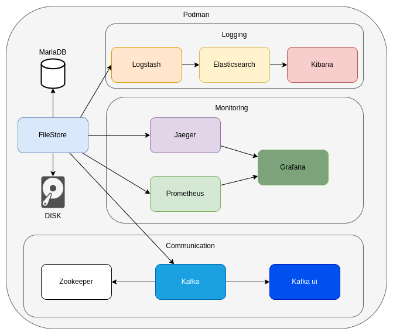

# FileStore documentation

## Application Architecture  
The architectural design of the application is detailed in the diagram provided.

  


## Environment variables

The following environment variables can be configured when running the application:

Environment variable | Sample value | Description |
--- | --- | --- |
SPRING_PROFILES_ACTIVE | dev | The profile to run with the application. |
LOGSTASH_ENABLED | "true" | Enable or disable log forwarding to Logstash (`"true"` or `"false"`). |
LOGSTASH_HOST | logstash | The name of the logstash container to push the logs from the springboot app. It is only required when the `LOGSTASH_ENABLED` environemnt variable is `"true"`. |
LOGSTASH_PORT | 5000 | The port of the logstash container. It is only required when the `LOGSTASH_ENABLED` environemnt variable is `"true"`. |
TRACING_ENABLED | "true" | Enable or disable tracing (`"true"` or `"false"`). |
TRACING_URL | http://jaeger:4318/v1/traces | The url of the jaeger instance for sending tracing details. It is only required when the `TRACING_ENABLED` environemnt variable is `"true"`. |
KAFKA_ENABLED | "true" | If set to `"true"` messages about file operations (such as successful uploads) will be sent to the appropriate Kafka topic. |
SPRING_DATASOURCE_URL | jdbc:mariadb://evocelot-mariadb:3306/sample | The JDBC URL of the DBMS to connect to. |
SPRING_DATASOURCE_USERNAME | root | The username for connecting to the DBMS. |
SPRING_DATASOURCE_PASSWORD | admin | The password for connecting to the DBMS. |
SPRING_DATASOURCE_DRIVER_CLASS_NAME | org.mariadb.jdbc.Driver | The fully qualified name of the JDBC driver class used for the DBMS connection. |
BUFFER_SIZE | 8192 | The size of the buffer determines the size of the chunks in which we read files into memory. The smaller its value, the more we load the CPU during file processing, but the less we burden the RAM.

## Volumes

You can mount the directory where you want to store the uploaded files as a volume for the application.
Within the application, you need to bind that directory to the `/store` path to access your files.

For example:

```bash
podman run \
    --name filestore \
    -p 8082:8080 \
    -v ./stored-files:/store \
    evocelot/filestore:1.0.0 \
```

According to the example, you will find the uploaded files in the `/stored-files` directory on your local computer.

## local.env

The project includes a file named `local.env`, which stores the application details.

Environment variable | Sample value | Description |
--- | --- | --- |
APPNAME | file-store-module | The name of the application |
VERSION | 0.0.1-SNAPSHOT | The version number of the application |

## Building the Docker Image

To build the Docker image for this application, use the following command:

```bash
make build-docker-image
```

This command reads the configuration from the `local.env` file, builds the Docker image with the specified settings, and tags it according to the `APPNAME` and `VERSION` values in the configuration.

## Loggin request and response details.

This Spring Boot application features a custom interceptor that `logs detailed information about incoming requests and outgoing responses in JSON format`. Each request and response log is enriched with a unique trace identifier `REQUEST-ID` that is also included in the response headers.

### REQUEST-ID in Request and Response Headers

Adds or uses a custom header `REQUEST-ID` from the request to ensure traceability between request and response logs. If the `REQUEST-ID` header is not present in the request, a new one is generated and included in the response headers.
